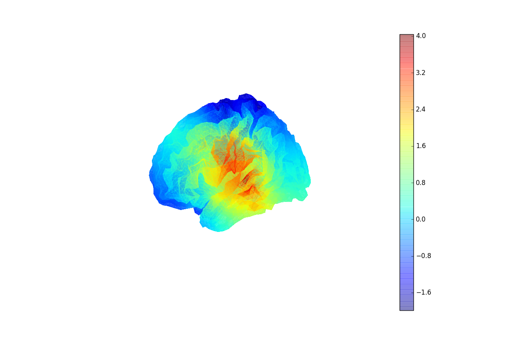

# PyBP: (Py) Brain Plotter

Lightweight functions for plotting overlays, networks, or both, on a cortical mesh.

See UserScript.py for an example of how to call the functions, plot & save.

(Working but also a work in progress)

# Overlay & Network

# Network

# Overlay

