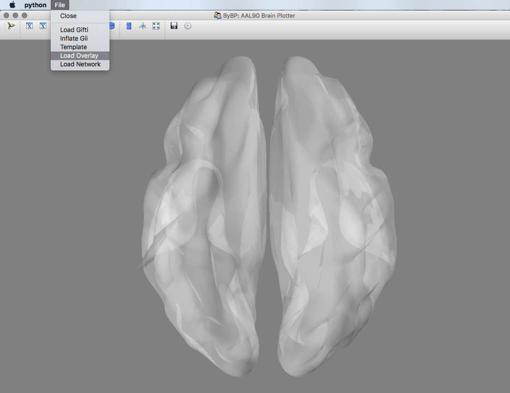
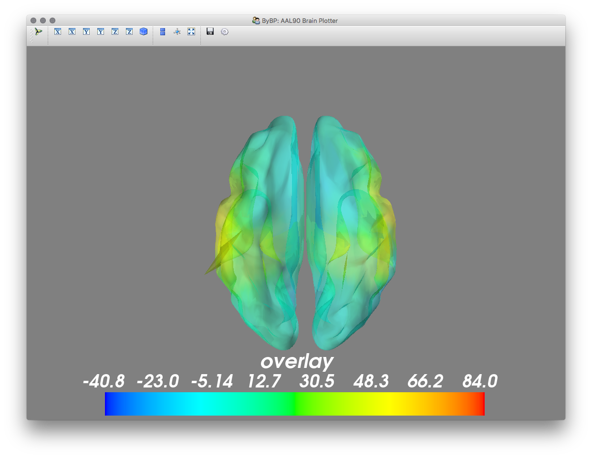

# PyBP: (Py) Brain Plotter for AAL90

The idea of this project is two-fold: 
1) I needed to be able to interpolate data from the 90-node AAL atlas onto subjects' cortical meshes. 
2) I wanted to be able to plot both a functional overlay and a network (nodes & edges) simultaneously. 

There are two versions:
* Code version now uses Qt, has traits(ui) rather than Tkinter interface and uses mayavi. Fast. Use this version.
* Old compiled version is still the old tkinter + matplotlib version (slow).

# The Functions

* Read gifti files (using nibabel)
* Fit a cortical mesh (e.g. template, glass brain) to AAL90 template source model
* Align & interpolate functional overlay onto mesh
* Plot mesh (using mayavi)
* Plot overlay
* Plot network from nxn numpy array
* Inflate mesh
* Compute mesh normals
* Compute mesh adjacency
* Sphere fitting


# Here are the deployment options:

1. Download this repo, navigate to it and launch the gui from command line using: $python New_PyBP.py
2. Download this repo and use pyinstaller to compile it to a mac app or windows exe. Code for this included, see PyCompile_PyBP
3. Download this repo, open up your python ide (e.g. spyder) and take a look at the example UserScript.py for how to call the functions and plots
4. (not recommended, slow) Download the older, slower, tkinter based mac app (.dmg contains .app) from [here!](https://www.dropbox.com/s/iahvx7m6xtyfzp1/PyBP_G.dmg?dl=0)

5. If you just want the functions, import PyBP: ```from PyBP import *```
6. (Get a template mesh & example overlay and network files, [here](https://www.dropbox.com/sh/w35j02u45602u4g/AACjzoSq-H7uskskiKBois3Ba?dl=0))

# Dependencies:

For command line / Spyder use:
* Mayavi
* Traits / Traitsui
* (Spyder / Anaconda)

For compiled use:
* PySide

# The App.
 
Download the code and compile it using pyinstaller, as per examples in PyCompile_PyBP. 

Here's some screenshots of the standalone.






# Examples:

Overlay & Network


Network


Overlay


# Usage

Access to options in gui by going to 'file'. Select load gifti, or inflate gifti, and select the .gii mesh to plot. Inflating is relatively quick, although it depends on the number of vertices in the mesh. Try out the 'NewSmoothed.gii' in the example directory.

To load a functional overlay, select it from file and choose a textfile with 90 new-line delimited values corresponding to the usual order of the 90 nodes. See OverlayData.txt in the example download to see how this file should look. Once opened, the iterative closest point algorithm interpolates the values onto the mesh, after centering and scaling both cloud points (AAL and mesh vertices).

To load a network, select it from the file menu and pick your .edge file. This is a usual .edge file (no .node file needed since it's always going to be the same set of nodes). The .edge contains a 90-by-90 matrix of connectivity values. (Note this can be easily written out from matlab using dlmwrite).

