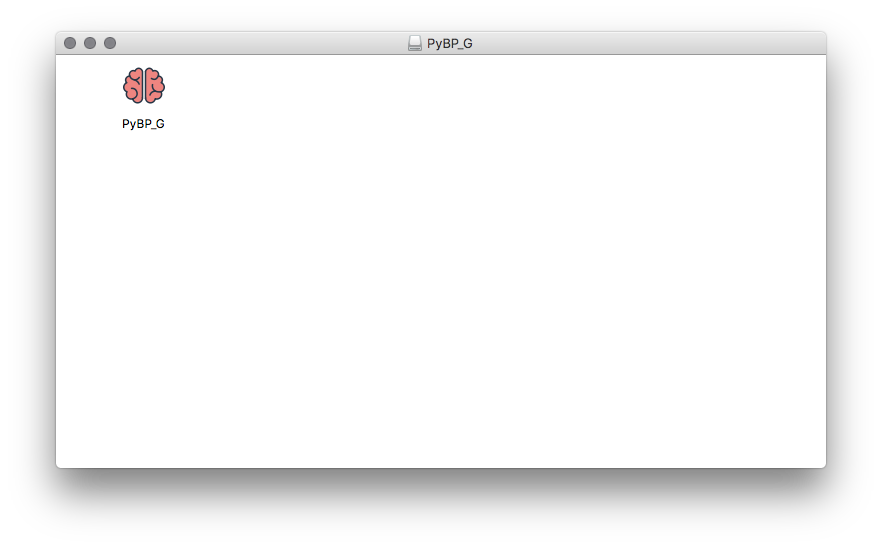
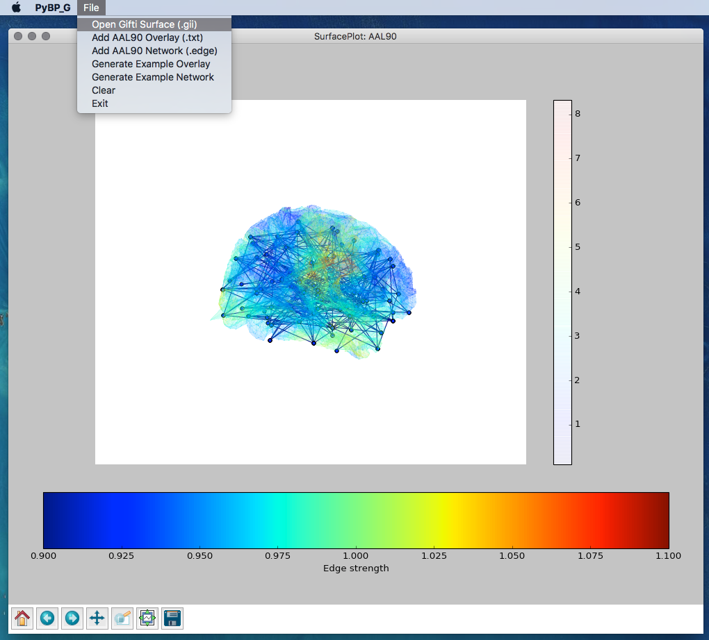
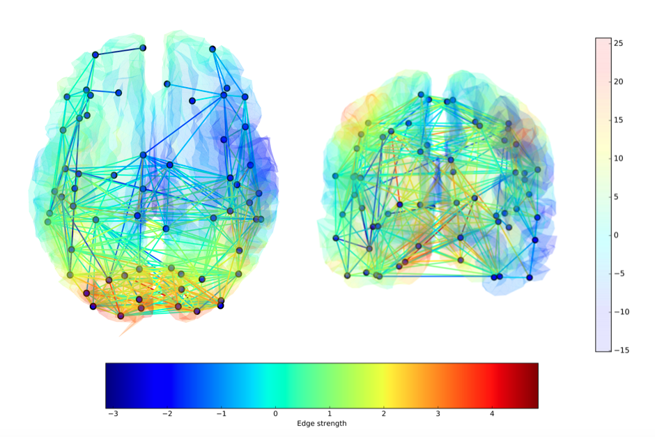
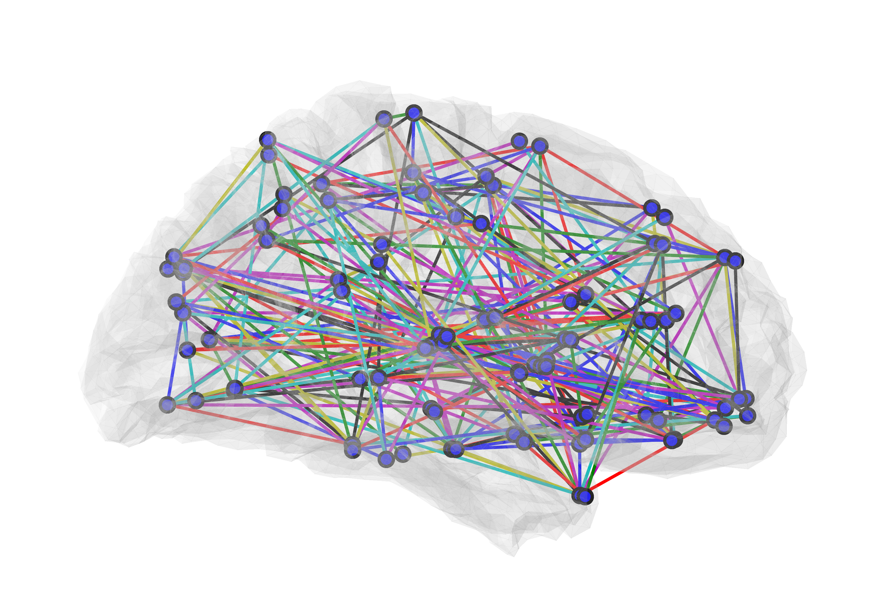
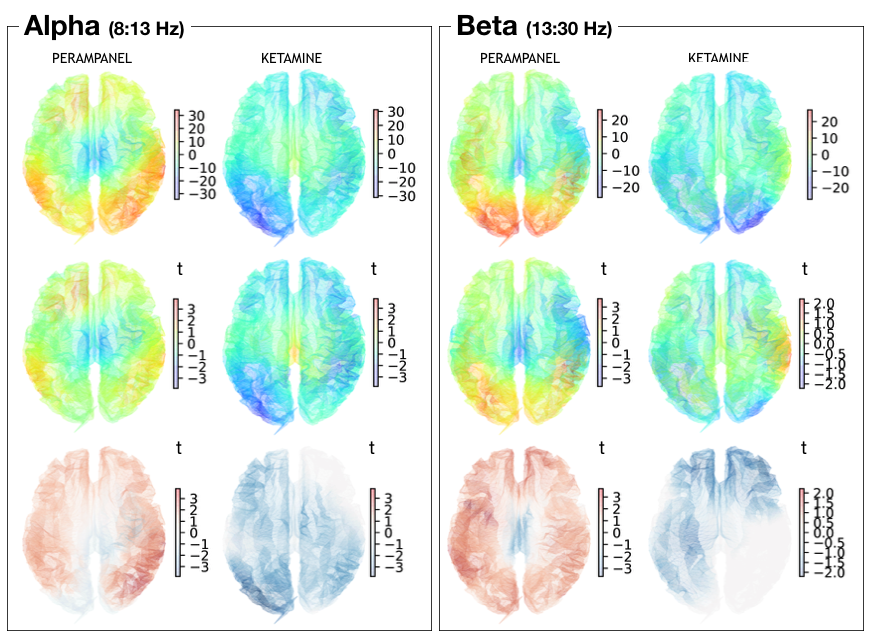

# PyBP: (Py) Brain Plotter for AAL90

The idea of this project is two-fold: first, I needed to be able to interpolate data from the 90-node AAL atlas onto subjects' cortical meshes. Second, I wanted to be able to plot both a functional overlay and a network (nodes & edges) simultaneously. 

Code version now uses a OpenGL, has traits(ui) rather than Tkinter interface and uses mayavi rather than matplotlib. 
Compiled version is still the old tkinter version (slow).

# Functions

* Read gifti files (using nibabel)
* Fit a cortical mesh (e.g. template, glass brain) to AAL90 template source model
* Align & interpolate functional overlay onto mesh
* Plot mesh (using mayavi)
* Plot overlay
* Plot network from nxn numpy array
* Inflate mesh
* Compute mesh normals
* Compute mesh adjacency
* Sphere fitting

There are three deployment options: 

1. **For mac, download the app (.dmg contains .app) from [here!](https://www.dropbox.com/s/iahvx7m6xtyfzp1/PyBP_G.dmg?dl=0)**
2. Download this repo, navigate to it and launch the gui using: $python New_PyBP.py
3. Download this repo, open up your python ide (e.g. spyder) and take a look at the example UserScript.py

4. If you just want the functions, import PyBP: ```from PyBP import *```
5. (Get a template mesh & example overlay and network files, [here](https://www.dropbox.com/sh/w35j02u45602u4g/AACjzoSq-H7uskskiKBois3Ba?dl=0))

# The App.

Download the .dmg and open it. You should see the app inside:



* Open the app, and you're presented with a blank window. 
* Go to File and select 'Open Gifti Surface' or 'Inflate Gifti Surface' and choose your .gii
* Once the brain mesh appears, you can load either an overlay or network, or both.

* For a network, select your '.edge' file which is a textfile which contains a 90x90 matrix. 
* For an overlay, select a '.txt' file which is a textfile containing a column vector of 90 values.

* Note: when selecting an overlay, an iterative closest point algorithm aligns and matches the surface points to the template (atlas) points. This process is a *bit* slow, and the app will look frozen with the spinning wheel of death, but hang tight for a minute... it hasn't crashed!




# Examples:

Overlay & Network



Network



Overlay




# Rotate (vis Script only at the moment)


